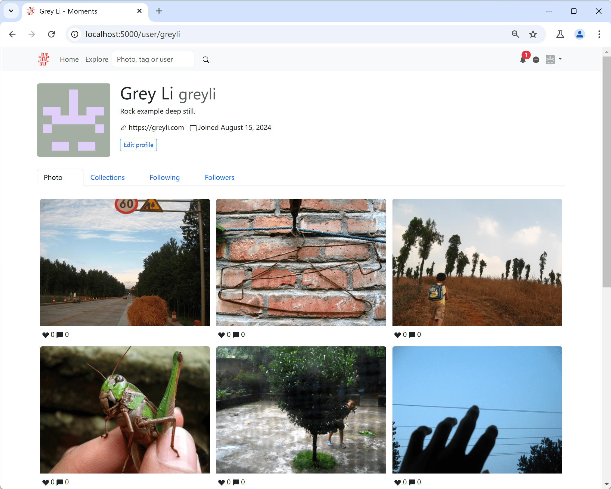

# Moments

A photo sharing social networking app built with Python and Flask. Fork of the example app from *[Python Web Development with Flask (2nd ed.)](https://helloflask.com/en/book/4)*, extended with **ML-powered accessibility and search**.



---

## What’s new in this fork

- **Auto alternative text (alt)** for user photos on upload using Azure AI Vision.  
- **Object search**: find photos by detected objects via a new **Object** category in Search.  
- Templates now ensure every user photo renders with an `alt="..."` (accessibility).

---

## Prerequisites

- Python **3.11** (we use [uv](https://docs.astral.sh/uv/) for env + deps)
- An Azure AI Vision resource (endpoint + key)

> macOS: `brew install uv`  
> Windows: `winget install --id=astral-sh.uv -e`

---

## Quick start

```bash
# 1) Clone
git clone https://github.com/<your-username>/moments.git
cd moments

# 2) Pin Python & install deps
uv python pin 3.11
uv sync

# 3) Configure environment
cp .env.example .env
python3 -c 'import secrets; print("SECRET_KEY=" + secrets.token_hex(32))' >> .env
# Edit .env and set:
# AZURE_VISION_ENDPOINT=https://<name>.cognitiveservices.azure.com
# AZURE_VISION_KEY=<key>

# 4) Initialize app (DB + roles)
uv run flask --app app init-app

# (Optional) generate lorem demo data
uv run flask --app app lorem

# 5) Run
uv run flask --app app run
# App: http://127.0.0.1:5000/
# Upload photos at /upload
